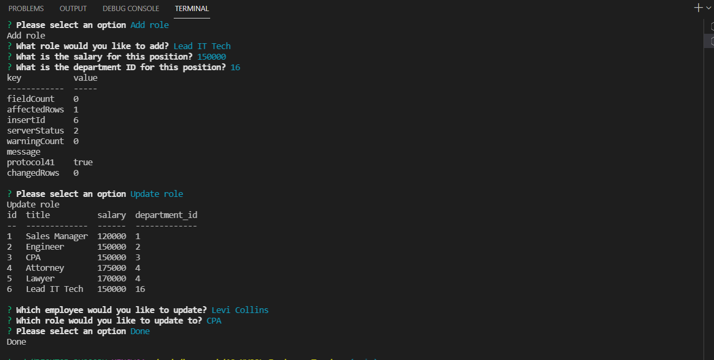

# 12-MYSQL-Employee-Tracker

# Description
This command line project uses MYSQL, Node and Inquirer to help manage a company's employees. It lets them view and add each employee, department and role in order to better organize their busineess. 

# Table of Contents
1. [Title](Title)
2. [Description](#description)
3. [Installation](#installation)
4. [Contributing](#contribution)
5. [Questions](#questions)
6. [License](#license)
7. [Demo](#Demo)
8. [Screenshot](#screenshot)
# Installation 
I used 'npm i' to insall all required pacakages.
# Contribution
Myself
# Questions
## GitHub 
 Lyndseyfin
## Email 
 lyndseyfinamore@gmail.com
## License

## Demo
<a href="https://youtu.be/J2X1zKBns88">Employee Tracker</a>

## Screenshot

